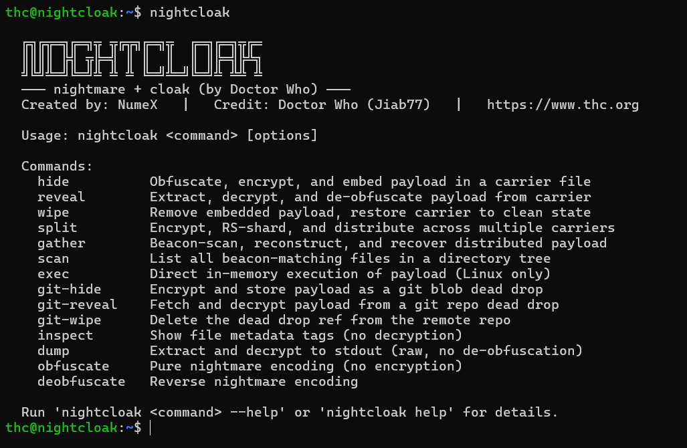

# NightCloak

A statically-linked Go binary that unifies metadata steganography and string obfuscation into a single tool. NightCloak embeds encrypted payloads into file metadata (EXIF, ID3, XMP), plain text files, and polyglot archives through a multi-layer pipeline: obfuscation, authenticated encryption, and native binary injection. Supports distributed resiliency via Reed-Solomon erasure coding and CRC64 algebraic beacon discovery.

Port and modernization of [cloak.sh](https://github.com/Jiab77/cloak) and [nightmare](https://codeberg.org/Jiab77/nightmare) by **Doctor Who (Jiab77)**. The core logic, wire format philosophy, and operational model are preserved. The implementation is new.

---

## Screenshot



---

## How It Works

### Single-Carrier Pipeline

```
hide                                            reveal
────                                            ──────
payload                                     carrier file
  │                                               │
  ▼                                               ▼
hex -> base64 -> ROT13/5               parse metadata -> extract
  │         (nightmare)                            │
  ▼                                               ▼
Argon2id(pw, salt) -> ChaCha20-Poly1305     ChaCha20 -> verify tag -> decrypt
  │                  (crypto layer)                │
  ▼                                               ▼
[optional] XChaCha20 envelope (KEY=)   [optional] strip XChaCha20
  │                                               │
  ▼                                               ▼
inject into carrier                     ROT13/5 -> base64 -> hex -> payload
       (cloak layer)
```

**Format routing:**

| Extension | Injection method | External tool |
|---|---|---|
| `.png` | Native tEXt chunk | No |
| `.jpg` / `.jpeg` | Native EXIF APP1 UserComment | No |
| `.mp3` | Native ID3v2 TXXX frame | No |
| `.pdf` (flat XREF) | Native /Info purge + rewrite | No |
| `.pdf` (1.5+ / encrypted) | exiftool fallback | Yes |
| `.txt` / `.md` / `.html` / `.htm` / `.json` / `.xml` / `.csv` | Native Unicode zero-width chars | No |
| `.jpg` / `.jpeg` / `.png` / `.pdf` (`poly-hide`) | Appended ZIP polyglot | No |
| `.avi` / `.ogg` | ffmpeg FFMETADATA1 | Yes |
| `.tiff` / others | exiftool | Yes |

### Distributed Pipeline (Ghost Network)

```
split                                           gather
─────                                           ──────
payload                               N carrier files in directory
  │                                               │
  ▼                                               ▼
nightmare + Argon2id + ChaCha20         CRC64 beacon scan (parallel)
  │                                   Beacon = HMAC-SHA256(pw, label)[:8]
  ▼                                               │
Reed-Solomon(K data, P parity)                    ▼
-> K+P encoded shard blobs             RevealReader per matched carrier
  │  each with 52-byte manifest                   │
  │  (index, K, P, PayloadID, size)               ▼
  ▼                                   group shards by PayloadID
inject each shard into carrier        Reed-Solomon reconstruct
  │                                               │
  ▼                                               ▼
append 8 CRC64 alignment bytes        Argon2id + ChaCha20 decrypt
so CRC64(file) == beacon target       -> nightmare decode -> payload
```

Any K of K+P carriers recover the original payload. The beacon enables stateless discovery across any directory without a manifest or filename list.

### Polyglot Pipeline

```
poly-hide                                   poly-reveal
─────────                                   ───────────
payload                                     polyglot file
  │                                               │
  ▼                                               ▼
nightmare + Argon2id + ChaCha20         scan from end for ZIP EOCD
  │                                               │
  ▼                                               ▼
create ZIP (STORE, uncompressed)        archive/zip extracts "data" entry
  │                                               │
  ▼                                               ▼
patch EOCD + central dir offsets        Argon2id + ChaCha20 decrypt
  +len(carrier)                                   │
  │                                               ▼
  ▼                                    nightmare decode -> payload
[carrier bytes trimmed to EOF]
  + ZIP bytes
```

JPEG/PNG/PDF parsers stop at `FFD9` / `IEND` / `%%EOF`. ZIP readers scan backward for EOCD. One file, two valid parsers. Carrier is unchanged from the perspective of image viewers and PDF readers.

### Git Dead Drop Pipeline

```
git-hide                                    git-reveal
────────                                    ──────────
payload                                     GitHub repo URL
  │                                               │
  ▼                                               ▼
nightmare + Argon2id + ChaCha20         GET refs/nc/latest -> commit SHA
  │                                               │
  ▼                                               ▼
POST blob -> tree -> orphan commit          GET blob -> ciphertext
  -> push refs/nc/latest (or custom ref)           │
                                                  ▼
                                          Argon2id + ChaCha20 decrypt
                                          -> nightmare decode -> payload
                                          [--exec: MemExec directly from RAM]
```

Payload is stored as an encrypted git blob object under a custom ref. The ref is invisible in GitHub's web UI, not fetched on `git clone`, and the blob content is opaque ciphertext.

---

## Security Model

### Authenticated Encryption

Original `cloak.sh` uses `openssl chacha20 -pbkdf2`, an unauthenticated stream cipher. A tampered ciphertext decrypts silently to garbage.

NightCloak uses **ChaCha20-Poly1305** (AEAD). Every decryption verifies a 16-byte Poly1305 tag before returning plaintext. Modification, wrong password, or truncation all fail explicitly with an error.

### Memory-Hard Key Derivation

Keys are derived with **Argon2id** (time=3, memory=64 MB, parallelism=4). Each attempt requires 64 MB of RAM, making GPU brute-force economically infeasible. A random 16-byte salt is generated per encryption and stored in the header.

Legacy PBKDF2 blobs are transparently detected and still decrypt correctly.

### Optional Double Encryption

When `KEY` is set, the payload is wrapped in an **XChaCha20-Poly1305** envelope before the primary layer, using an independent 24-byte nonce and separate key material.

### Anti-Forensic Ciphertext (v3 Format)

> [!NOTE]
> v3 is the default output format since v0.9.6. `reveal` auto-detects v3 / v2 / v1, no flags needed on the receiving end.

**Wire format:** `[4B magic][1B flags][16B salt][12B nonce][ciphertext + tag]`

| Flag | Behavior |
|---|---|
| *(always on)* random padding | 0-512 bytes of random data prepended inside the envelope. Same payload hides to different ciphertext sizes each run. |
| `--compress` | DEFLATE before encryption. Only activates when it actually reduces size. |
| `--lock` | Key derived from hardware identity (`/etc/machine-id`, `hw.uuid`, MAC fallback). Carrier fails to decrypt on any other host, even with the correct password. |

> [!TIP]
> `--compress` and `--lock` can be combined freely. `reveal` detects all flags automatically.

### Native Zero-Dependency Engine

All obfuscation and cryptographic operations run natively in Go. For core formats, NightCloak performs surgical binary manipulation without spawning child processes or touching temporary files:

- **PNG:** Injects a tEXt chunk before the IEND marker. Streams chunk-by-chunk without loading the full carrier into memory.
- **JPEG:** Constructs a parallel APP1 segment with a valid TIFF/EXIF structure. The payload is stored in the UserComment (0x9286) tag with an undefined charset prefix, making it indistinguishable from camera-vendor encoded comments.
- **MP3:** Injects a TXXX frame into the ID3v2 tag. Uses a padding-first optimization that overwrites existing ID3v2 padding to avoid shifting the audio stream, ensuring bit-perfect audio preservation. Verified by SHA256 comparison in the test suite.
- **PDF:** Implements a Native Purge Engine that parses the full XREF chain and re-emits a clean single-pass PDF. Eliminates incremental update artifacts and ghost data traces common in PDF metadata editors. Falls back to exiftool for PDF 1.5+ compressed XREF streams and encrypted PDFs.
- **Text files (.txt, .md, .html, .htm, .json, .xml, .csv):** Appends payload as invisible Unicode zero-width characters (ZWSP/ZWJ bit encoding with ZWNJ frame markers). Invisible in all renderers and editors. Survives copy-paste. No visual artifact, no binary signature.

### In-Memory Execution (Linux)

`exec` and `git-reveal --exec` run the payload directly from RAM using `memfd_create` + `execveat(AT_EMPTY_PATH)`. The binary never touches disk. `execveat` with `AT_EMPTY_PATH` executes the file descriptor directly, no `/proc/self/fd/<n>` path string is opened or stored in memory. Supports amd64, arm64, arm32, and mips architectures.

### Git Dead Drop

`git-hide` / `git-reveal` / `git-wipe` use a GitHub repository as a covert carrier. The encrypted payload is stored as a git blob object under a custom ref (default: `refs/nc/latest`). Detection surface:

| Surface | Visible? |
|---|---|
| GitHub web UI (branches, files, commits) | No |
| `git clone` | No (not in default fetch refspec) |
| `git log` | No |
| `git ls-remote` | Ref name only, no content |

The blob content is opaque v3 ciphertext. Even if retrieved, it is unreadable without the password.

### Polyglot Carrier (ZIP Append)

`poly-hide` appends an encrypted ZIP archive to the end of a JPEG, PNG, or PDF carrier. The result is simultaneously:

- A **valid image/PDF**: viewers, browsers, and renderers parse the carrier normally and stop at the format's end-of-content marker.
- A **valid ZIP**: `unzip`, `7z`, and `file` recognize the ZIP structure at the file end. The ZIP contains a single entry with opaque v3 ciphertext, unreadable without the password.

`poly-wipe` strips the ZIP and restores the original carrier bytes without a password. Timestamps are preserved.

### Surgical Wipe

`wipe` removes an embedded payload and restores the carrier to a clean state. Format-aware: PNG drops the tEXt chunk, JPEG strips the APP1 segment, MP3 removes the TXXX frame, PDF purge-rewrites without `/Keywords`, text files strip the invisible char block. Carrier timestamps are restored after wipe.

### Distributed Resiliency

- **Reed-Solomon (K, P):** payload splits into K data + P parity shards. Any K of K+P carriers recover the original, up to P carriers may be lost or deleted.
- **CRC64 algebraic beacon:** each carrier has 8 bytes appended such that `CRC64(file) == HMAC-SHA256(password, "nightcloak-beacon-v1")[:8]`. The 8-byte solution is computed in O(64) via the precomputed inverse of the CRC64/ECMA GF(2)-linear map. Parallel scanner (NumCPU goroutines) identifies all carriers in a directory tree in a single pass, no filename list, no manifest, no external state.
- **Self-describing manifests:** each shard carries a 52-byte header with index, shard counts, payload size, and per-payload HMAC identifier. The scanner groups shards from multiple independent split operations in a single directory.

---

## Usage

### Install

```bash
go install github.com/NumeXx/nightcloak/cmd/nightcloak@latest
```

Or a specific version:

```bash
go install github.com/NumeXx/nightcloak/cmd/nightcloak@v1.0.0
```

Pre-built binaries for linux/darwin/windows are available on the [releases page](https://github.com/NumeXx/nightcloak/releases).

### Build from source

```bash
CGO_ENABLED=0 go build -o nightcloak cmd/nightcloak/main.go
```

Cross-compile without CGO:

```bash
GOOS=linux   GOARCH=amd64 CGO_ENABLED=0 go build ./...
GOOS=darwin  GOARCH=arm64 CGO_ENABLED=0 go build ./...
GOOS=windows GOARCH=amd64 CGO_ENABLED=0 go build ./...
```

### Single-Carrier (Images, Audio, PDF)

```bash
# Hide / reveal
nightcloak hide photo.jpg "secret message" -p mypass
nightcloak reveal photo.jpg -p mypass

# Wipe: restore carrier to clean state
nightcloak wipe photo.jpg -p mypass

# Compress before encryption
nightcloak hide photo.jpg payload.txt -p mypass --compress

# Lock carrier to this machine only
nightcloak hide photo.jpg "secret" -p mypass --lock

# Double encryption (primary password + secondary key)
KEY=- nightcloak hide photo.jpg payload.bin -p mypass
# stderr: [KEY] <base58key>  <- save this
KEY="<base58key>" nightcloak reveal photo.jpg -p mypass

# Pipe to stdout
nightcloak reveal photo.jpg -p mypass | file -
```

### Text Carriers (Unicode)

Any `.txt`, `.md`, `.html`, `.htm`, `.json`, `.xml`, or `.csv` file works as a carrier. The host text is unchanged and renders normally in all editors, browsers, and terminals.

```bash
# Hide in a markdown file
nightcloak hide README.md secret.txt -p mypass

# Reveal
nightcloak reveal README.md -p mypass

# Wipe (no password required, purely structural)
nightcloak wipe README.md -p mypass

# Works with any text format
nightcloak hide config.json payload.bin -p mypass
nightcloak hide notes.txt "classified" -p mypass
```

### Distributed Ghost Network

```bash
# Split across 6 carriers, recover from any 4
nightcloak split secret.bin ./media/ -n 6 -k 4 -p mypass

# Scan for beacon-matching carriers
nightcloak scan ./media/ -p mypass

# Reconstruct (tolerates up to 2 lost)
nightcloak gather ./media/ -p mypass -o recovered.bin

# Full pipeline with double encryption
export NIGHT_PASSWORD="mypass"
export KEY="myxkey"
nightcloak split secret.bin ./media/ -n 6 -k 4
nightcloak gather ./media/ -o recovered.bin
```

### Polyglot Carrier (ZIP Append)

```bash
# Embed in JPEG, result is valid JPEG and valid ZIP
nightcloak poly-hide photo.jpg secret.txt -p mypass

# Embed in PDF
nightcloak poly-hide document.pdf payload.bin -p mypass -o poly.pdf

# Reveal
nightcloak poly-reveal poly.jpg -p mypass
nightcloak poly-reveal poly.pdf -p mypass -o recovered.bin

# Verify with standard tools
file poly.jpg          # JPEG image data, ...
unzip -l poly.jpg      # Archive: poly.jpg  Length: ...

# Restore original carrier (no password)
nightcloak poly-wipe poly.jpg
```

### Git Dead Drop

```bash
export NIGHTCLOAK_GIT_TOKEN=<github-pat>

# Store encrypted payload in a GitHub repo
nightcloak git-hide secret.bin https://github.com/owner/repo -p mypass

# Custom ref (blends with CI/CD noise)
nightcloak git-hide secret.bin https://github.com/owner/repo -p mypass -r refs/notes/ci

# Retrieve and decrypt
nightcloak git-reveal https://github.com/owner/repo -p mypass

# Retrieve and execute directly from memory (Linux only)
nightcloak git-reveal https://github.com/owner/repo -p mypass --exec

# Wipe the ref from the remote
nightcloak git-wipe https://github.com/owner/repo
nightcloak git-wipe https://github.com/owner/repo -r refs/notes/ci
```

**Token scope required:** `repo` for private repos, `public_repo` for public repos. Fine-grained token: `Contents: Read and Write` on the specific repo only.

### Automation

```bash
export NIGHT_PASSWORD="mypassword"

nightcloak hide photo.jpg secret.bin -o hidden.jpg
nightcloak reveal hidden.jpg

# Generate a random XChaCha20 key
KEY=- nightcloak hide photo.jpg payload.bin
```

### Environment Variables

| Variable | Behavior |
|---|---|
| `NIGHT_PASSWORD` | Primary password (same priority as `-p`) |
| `KEY=<string>` | Secondary XChaCha20 key (raw string or Base58-decoded 32-byte key) |
| `KEY=-` | Generate a random key, print Base58 to stderr |
| `NIGHTCLOAK_GIT_TOKEN` | GitHub PAT for git-hide / git-reveal / git-wipe (same priority as `-t`) |

---

## Requirements

| Dependency | Required for | Install |
|---|---|---|
| Go 1.21+ | Building from source | [golang.org](https://go.dev/dl/) |
| `exiftool` | TIFF, encrypted PDF, PDF 1.5+ compressed XREF (optional) | `brew install exiftool` / `apt install libimage-exiftool-perl` |
| `ffmpeg` | AVI, OGG containers (optional) | `brew install ffmpeg` / `apt install ffmpeg` |

Core formats (PNG, JPEG, MP3, PDF flat XREF, all text formats) and the full distributed pipeline require no external tools on any platform.

---

## Tests

```bash
go test ./... -v
```

131 tests across five packages (`nightmare`, `crypto`, `cloak`, `cloak/native`, `shard`) covering byte-level integrity, cryptographic roundtrips, Reed-Solomon recovery, CRC64 algebraic inversion, polyglot round-trip, and forensic cleanliness.

---

## Attribution

| Person | Contribution |
|---|---|
| **Me (NumeX)** | Go modernization, native engines, distributed resiliency layer |
| **Doctor Who (Jiab77)** | Original author of `cloak.sh`, `nightmare`, and `base82` |
| **Skyper (THC)** | Concepts of random-size padding and host-locked execution, from [bincrypter](https://github.com/hackerschoice/bincrypter) |

---

## Star History

[](https://star-history.com/#NumeXx/nightcloak&Date)

---

## Disclaimer

This tool is intended for authorized security testing, research, and educational purposes. Use it responsibly and in compliance with applicable laws.
